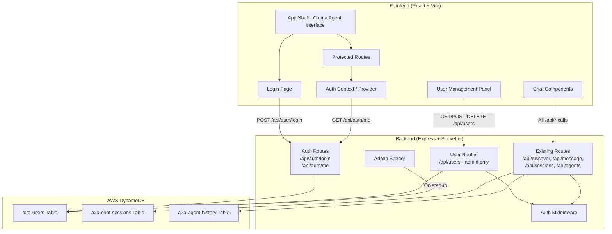
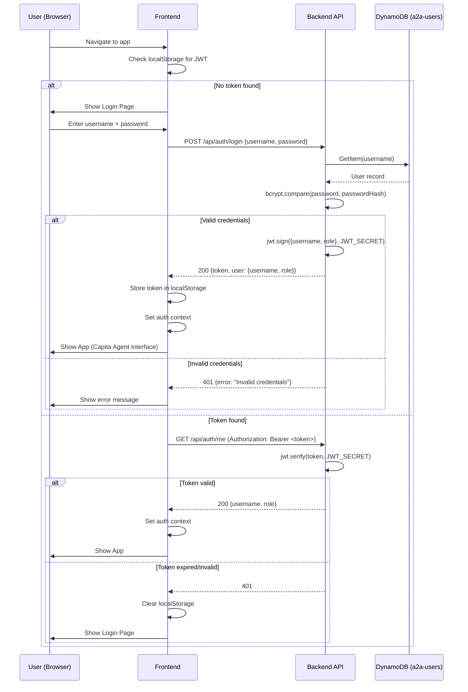
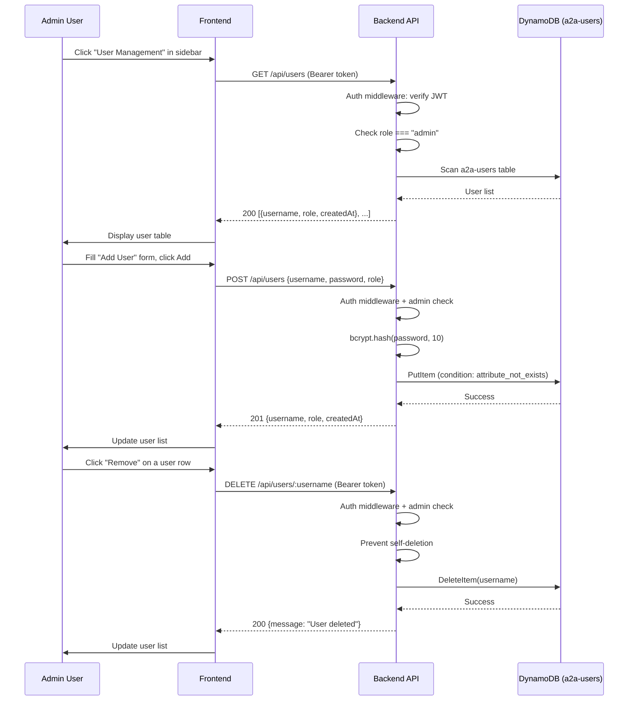

# Design Document: User Authentication & Management for Capita Agent Interface

## Overview

This feature adds JWT-based authentication and role-based user management to the existing A2A Chat Client application, which is being renamed to "Capita Agent Interface." Every route (both UI and API) will be gated behind authentication so that only logged-in users can interact with agents. Admin users gain access to a user management panel for creating and removing user accounts. A default admin account is seeded on first startup to bootstrap the system.

The implementation builds on the existing Node.js/Express backend and React/Vite frontend. A new DynamoDB table (`a2a-users`) stores user credentials and roles. The backend gains auth middleware, login/session endpoints, and admin-only user CRUD endpoints. The frontend gains a login page, an auth context provider, protected route wrappers, and an admin-only user management component. The app is also renamed from "A2A Chat" to "Capita Agent Interface" across all user-facing surfaces.

## Architecture

### Updated High-Level Architecture



### Authentication Flow



### Admin User Management Flow



## Components and Interfaces

### Backend Components

#### 1. Auth Middleware (`middleware/auth.js`)

**Purpose**: Validates JWT tokens on all protected API routes. Extracts user info and attaches it to the request object.

**Interface**:
```javascript
// Middleware function signature
function authMiddleware(req, res, next)

// After successful validation, req.user is set:
// req.user = { username: string, role: 'admin' | 'user' }
```

**Responsibilities**:
- Extract Bearer token from `Authorization` header
- Verify token using `jwt.verify()` with `JWT_SECRET` env var
- Attach decoded `{ username, role }` to `req.user`
- Return 401 if token is missing, expired, or invalid
- Skip validation for `/api/auth/login` (public route)

#### 2. Admin Middleware (`middleware/admin.js`)

**Purpose**: Restricts access to admin-only endpoints. Must be used after auth middleware.

**Interface**:
```javascript
function adminMiddleware(req, res, next)
```

**Responsibilities**:
- Check `req.user.role === 'admin'`
- Return 403 if user is not an admin
- Call `next()` if authorized

#### 3. Auth Routes (`routes/auth.js`)

**Purpose**: Handles user login and session validation.

**Interface**:
```javascript
// POST /api/auth/login
// Request:  { username: string, password: string }
// Response: { token: string, user: { username: string, role: string } }
// Errors:   400 (missing fields), 401 (invalid credentials)

// GET /api/auth/me
// Headers:  Authorization: Bearer <token>
// Response: { username: string, role: string }
// Errors:   401 (invalid/expired token)
```

**Responsibilities**:
- Validate login request body (username and password required)
- Look up user in DynamoDB by username
- Compare password with stored hash using bcrypt
- Generate JWT with `{ username, role }` payload, 24h expiry
- `/me` endpoint decodes token and returns user info

#### 4. User Routes (`routes/users.js`)

**Purpose**: Admin-only CRUD operations for user management.

**Interface**:
```javascript
// GET /api/users
// Response: [{ username: string, role: string, createdAt: string }, ...]

// POST /api/users
// Request:  { username: string, password: string, role?: 'admin' | 'user' }
// Response: { username: string, role: string, createdAt: string }
// Errors:   400 (missing fields, user exists), 403 (not admin)

// DELETE /api/users/:username
// Response: { message: "User deleted" }
// Errors:   400 (self-deletion), 403 (not admin), 404 (user not found)
```

**Responsibilities**:
- List all users (excluding passwordHash from response)
- Create new users with bcrypt-hashed passwords
- Prevent duplicate usernames (DynamoDB conditional put)
- Delete users by username
- Prevent admin from deleting their own account
- Default role to `'user'` if not specified

#### 5. User Service (`services/userService.js`)

**Purpose**: DynamoDB operations for the `a2a-users` table.

**Interface**:
```javascript
async function createUser({ username, passwordHash, role })
// Returns: { username, role, createdAt }
// Throws: ConditionalCheckFailedException if username exists

async function getUserByUsername(username)
// Returns: { username, passwordHash, role, createdAt } | null

async function listUsers()
// Returns: [{ username, role, createdAt }, ...] (no passwordHash)

async function deleteUser(username)
// Returns: void
```

**Responsibilities**:
- Uses existing DynamoDB client from `services/dynamodb.js`
- Table name from `USERS_TABLE` env var (default: `a2a-users`)
- `createUser`: PutItem with `attribute_not_exists(username)` condition
- `listUsers`: Scan with ProjectionExpression excluding `passwordHash`
- `deleteUser`: DeleteItem by username partition key

#### 6. Admin Seeder (`services/seedAdmin.js`)

**Purpose**: Seeds a default admin user on application startup if no users exist.

**Interface**:
```javascript
async function seedDefaultAdmin()
// Creates admin/admin user if a2a-users table is empty
// Logs result to console
```

**Responsibilities**:
- Check if any users exist in the table (Scan with Limit 1)
- If empty, create user `{ username: 'admin', password: 'admin', role: 'admin' }`
- Hash password with bcrypt before storing
- Log "Default admin user created" or "Users already exist, skipping seed"
- Called once during server startup in `server.js`

### Frontend Components

#### 7. Auth Context (`hooks/useAuth.js`)

**Purpose**: React context providing authentication state and actions to the entire app.

**Interface**:
```javascript
// Context value shape:
{
  user: { username: string, role: string } | null,
  token: string | null,
  isAuthenticated: boolean,
  isAdmin: boolean,
  isLoading: boolean,
  login: (username: string, password: string) => Promise<void>,
  logout: () => void,
}
```

**Responsibilities**:
- On mount: check localStorage for existing token, validate via `GET /api/auth/me`
- `login()`: call `POST /api/auth/login`, store token in localStorage, set user state
- `logout()`: clear localStorage, reset user state, redirect to login
- Provide `isAdmin` computed from `user.role === 'admin'`
- `isLoading` is true during initial token validation

#### 8. Login Page (`components/LoginPage.jsx`)

**Purpose**: Full-page login form displayed when user is not authenticated.

**Interface**:
```javascript
// Props: none (uses useAuth context)
// Renders: centered login form with username, password fields, submit button
```

**Responsibilities**:
- Username and password input fields
- Submit button triggers `auth.login(username, password)`
- Display error message on failed login
- Redirect to main app on successful login
- Clean, centered layout matching app design

#### 9. User Management Panel (`components/UserManagement.jsx`)

**Purpose**: Admin-only panel for managing user accounts, displayed in the sidebar.

**Interface**:
```javascript
// Props: none (uses useAuth context for admin check)
// Renders: user list table + add user form
```

**Responsibilities**:
- Fetch and display list of users with username, role, and creation date
- "Add User" form with username, password, and role (dropdown: user/admin) fields
- "Remove" button per user row (with confirmation)
- Prevent removing the currently logged-in admin
- Refresh list after add/remove operations
- Only rendered when `isAdmin` is true

#### 10. Updated App Shell (`App.jsx`)

**Purpose**: Wraps the existing app with auth context and conditional rendering.

**Responsibilities**:
- Wrap entire app in `AuthProvider`
- If not authenticated: render `LoginPage`
- If authenticated: render existing app layout (Sidebar + ChatArea)
- Show loading spinner during initial auth check
- Display "Capita Agent Interface" as app title

#### 11. Updated Sidebar (`components/Sidebar.jsx`)

**Responsibilities** (additions):
- Display logged-in username and role
- Show "User Management" section if user is admin
- Add "Logout" button
- Rename header from "A2A Chat" to "Capita Agent Interface"

#### 12. Updated API Service (`services/api.js`)

**Responsibilities** (additions):
- Add `Authorization: Bearer <token>` header to all API calls
- Add `login(username, password)` function
- Add `getMe(token)` function
- Add `listUsers()`, `createUser()`, `deleteUser()` functions
- Handle 401 responses globally (trigger logout)

## Data Models

### New DynamoDB Table: `a2a-users`

| Attribute | Type | Description |
|-----------|------|-------------|
| `username` (PK) | String | Unique username, partition key |
| `passwordHash` | String | bcrypt-hashed password |
| `role` | String | `"admin"` or `"user"` |
| `createdAt` | String | ISO 8601 timestamp |

**Validation Rules**:
- `username`: required, non-empty string, unique (enforced by PK)
- `passwordHash`: required, generated via `bcrypt.hash(password, 10)`
- `role`: required, must be one of `"admin"` or `"user"`
- `createdAt`: auto-set on creation, ISO 8601 format

### JWT Token Payload

```javascript
{
  username: string,  // User's username
  role: string,      // "admin" or "user"
  iat: number,       // Issued at (auto by jwt.sign)
  exp: number,       // Expiry (24h from issuance)
}
```

### Environment Variables (New)

| Variable | Default | Description |
|----------|---------|-------------|
| `JWT_SECRET` | (required) | Secret key for signing JWTs |
| `USERS_TABLE` | `a2a-users` | DynamoDB table name for users |

## Error Handling

### Authentication Errors

**Condition**: Missing or invalid Authorization header on protected routes
**Response**: 401 `{ error: "Authentication required" }`
**Recovery**: Frontend clears stored token and redirects to login page

### Invalid Credentials

**Condition**: Username not found or password mismatch during login
**Response**: 401 `{ error: "Invalid credentials" }`
**Recovery**: User retries with correct credentials. Generic error message prevents username enumeration.

### Expired Token

**Condition**: JWT has passed its 24h expiry
**Response**: 401 `{ error: "Token expired" }`
**Recovery**: Frontend clears token, shows login page. User re-authenticates.

### Forbidden (Non-Admin)

**Condition**: Non-admin user attempts to access `/api/users` endpoints
**Response**: 403 `{ error: "Admin access required" }`
**Recovery**: Frontend hides admin UI for non-admin users; this is a defense-in-depth check.

### Duplicate Username

**Condition**: Admin tries to create a user with an existing username
**Response**: 400 `{ error: "Username already exists" }`
**Recovery**: Admin chooses a different username.

### Self-Deletion Prevention

**Condition**: Admin tries to delete their own account
**Response**: 400 `{ error: "Cannot delete your own account" }`
**Recovery**: Another admin must delete the account if needed.

## Testing Strategy

### Unit Testing Approach

- Auth middleware: test token validation, missing token, expired token, malformed token
- Admin middleware: test admin role check, non-admin rejection
- User service: test CRUD operations against DynamoDB (mocked)
- Password hashing: verify bcrypt hash/compare round-trip
- JWT generation: verify token contains correct payload and expiry

### Property-Based Testing Approach

**Property Test Library**: fast-check

- JWT round-trip: for any valid `{ username, role }`, signing then verifying produces the original payload
- Password hash round-trip: for any password string, `bcrypt.compare(password, bcrypt.hash(password))` returns true
- Auth middleware consistency: for any valid token, middleware always sets `req.user` with matching username and role

### Integration Testing Approach

- Full login flow: create user → login → access protected route → verify response
- Admin flow: login as admin → create user → list users → delete user → verify deletion
- Token expiry: login → wait/mock expiry → verify 401 on protected route
- Non-admin restriction: login as regular user → attempt admin endpoints → verify 403

## Security Considerations

- Passwords are never stored in plaintext; bcrypt with cost factor 10 is used
- JWT secret must be set via environment variable, not hardcoded
- Generic "Invalid credentials" message prevents username enumeration
- Admin seeder creates a default `admin/admin` account — should be changed on first real deployment
- All `/api/*` routes except `/api/auth/login` require valid JWT
- Admin endpoints have an additional role check layer
- Tokens expire after 24 hours to limit exposure window
- Frontend clears tokens on 401 responses to prevent stale token usage

## Dependencies

### New Backend Dependencies

| Package | Purpose |
|---------|---------|
| `jsonwebtoken` | JWT signing and verification |
| `bcryptjs` | Password hashing (pure JS, no native deps) |

### Existing Dependencies (Unchanged)

- `express`, `cors`, `socket.io`, `@aws-sdk/client-dynamodb`, `@aws-sdk/lib-dynamodb`, `dotenv`, `uuid`, `axios`

## Renaming: A2A Chat → Capita Agent Interface

The following locations require renaming:

| Location | Current | New |
|----------|---------|-----|
| `frontend/index.html` `<title>` | A2A Chat Client | Capita Agent Interface |
| `Sidebar.jsx` header `<h2>` | A2A Chat | Capita Agent Interface |
| Any user-facing strings | A2A Chat | Capita Agent Interface |
| localStorage key | `a2a-agent-url` | `capita-agent-url` (optional) |

## Correctness Properties

### Property 1: Authentication Gate Completeness
For ALL API routes matching `/api/*` EXCEPT `/api/auth/login`, any request WITHOUT a valid JWT in the Authorization header SHALL receive a 401 response. No protected data or functionality is accessible without authentication.

### Property 2: JWT Round-Trip Integrity
For ANY valid user `{ username, role }`, signing a JWT with `jwt.sign({username, role}, JWT_SECRET)` and then verifying with `jwt.verify(token, JWT_SECRET)` SHALL produce a payload where `decoded.username === username` AND `decoded.role === role`.

### Property 3: Password Hash Security
For ANY password string `p`, `bcrypt.hash(p, 10)` produces a hash `h` such that `bcrypt.compare(p, h)` returns `true`, AND `bcrypt.compare(q, h)` returns `false` for any `q !== p` (with overwhelming probability).

### Property 4: Admin Authorization Enforcement
For ALL requests to `/api/users` endpoints, if `req.user.role !== 'admin'`, the response SHALL be 403. No user management operations are possible for non-admin users regardless of how the request is constructed.

### Property 5: Self-Deletion Prevention Invariant
For ANY authenticated admin user making a `DELETE /api/users/:username` request where `:username` matches their own `req.user.username`, the response SHALL be 400 and the user record SHALL NOT be deleted.

### Property 6: Default Admin Seeding Idempotency
The seed function SHALL create a default admin user if and only if the `a2a-users` table contains zero records. On subsequent startups with existing users, the seed function SHALL make no modifications to the table.

### Property 7: Token Expiry Enforcement
For ANY JWT issued by the system, after 24 hours from issuance, `jwt.verify()` SHALL throw a `TokenExpiredError`, and the auth middleware SHALL return 401 for requests bearing that token.

### Property 8: Username Uniqueness Enforcement
For ANY `POST /api/users` request with a `username` that already exists in the `a2a-users` table, the response SHALL be 400 and no data SHALL be modified.
